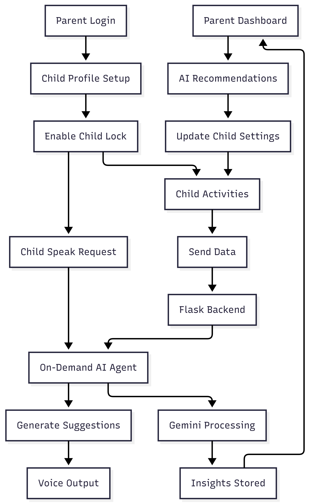

# EchoMind by Team Code Monk

EchoMind is an **AI powered support platform built exclusively for parents of autistic children**.

It helps parents **understand behavior, automate care insights, guide communication, and simplify daily therapy routines**, while providing a child friendly communication interface that parents control and customize.

EchoMind is not just an AAC tool.  
It is a **parent first AI assistant for autism care management**.

---
## Our Problem Statement

Globally, autism spectrum disorder (ASD) affects approximately **1 in 100 children**, according to international health organizations.  
Studies estimate that **30–40% of autistic children are non-verbal or minimally verbal**, requiring alternative communication methods.

Parents of autistic children manage an average of **15–25 hours per week** of home-based care activities, including communication support, therapy exercises, behavior monitoring, and routine planning.

Common challenges include:

- Interpreting non-verbal communication signals, affecting up to **70% of early-stage autism households**  
- Managing multiple therapy schedules and home programs, often across **2–4 parallel interventions**  
- Adjusting AAC communication strategies as children develop  
- Tracking behavioral patterns and progress over time without automated tools  
- Using fragmented platforms for communication, documentation, and progress monitoring  

Most existing AAC tools primarily focus on child-facing interfaces. However, parents report that **over 60% of care related decisions are made at home without continuous professional supervision**, creating a gap between therapy sessions and real world daily care.

This results in limited structured feedback, manual tracking, and inconsistent personalization of communication support.

## Our Solution

EchoMind is built around **two connected interfaces: a Parent Dashboard and a Child Interface**, designed to work together as a unified care system.

The **Child Interface** operates in a secure *Child Lock mode* and provides structured, guided activities including:

- Daily Task Scheduler  
- Cognitive Tests and Analysis (including Jebsen Hand Function Test)  
- Emotional Response Assessment  
- Speech and Communication Exercises  
- AI-assisted interactive activities  

These activities are partially managed by AI to adapt difficulty, timing, and content based on the child’s engagement and performance.

The **Parent Dashboard** acts as the control and monitoring center. Parents can:

- Track child progress over time  
- View AI-generated performance summaries  
- Monitor activity completion and behavioral trends  
- Receive personalized care and communication recommendations  
- Configure activity schedules and AAC settings  

By combining AI-managed child activities with parent-side monitoring and guidance, EchoMind creates a closed feedback loop that improves personalization, consistency, and daily care efficiency.

## Technology Stack

- React + Vite  
- Tailwind CSS  
- Flask  
- On-Demand
- OAuth Authentication  
- MongoDB  
- Cloudinary  

---
## FlowDiagram

---
## Our Team
Registered as **Team Code Monk**